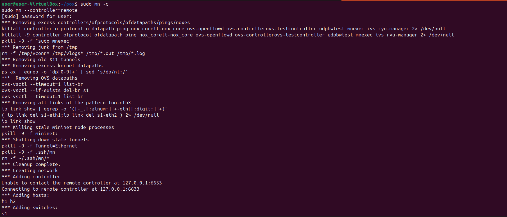
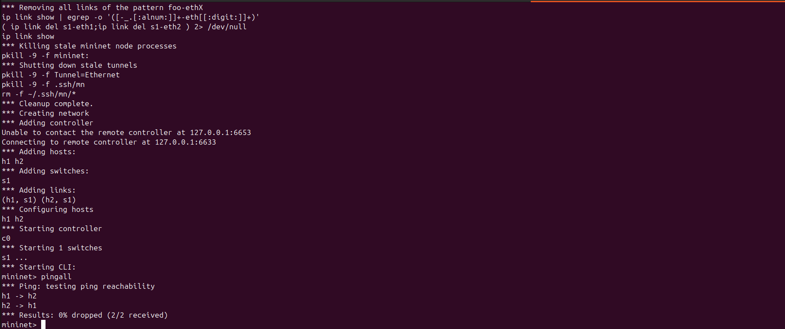
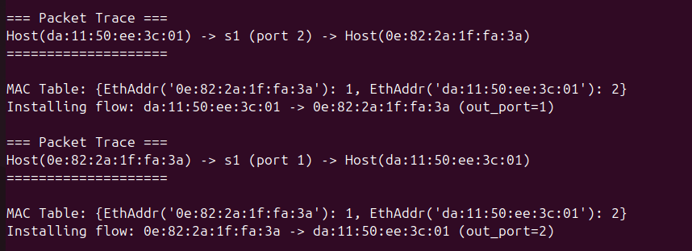

# 🚀 SDN Path Tracing Tool using Mininet and POX

## 📌 Overview

This project implements a **Software Defined Networking (SDN) based path tracing tool** using **Mininet** and the **POX controller**. The system tracks how packets travel across a network by analyzing flow rules and dynamically determining the forwarding path between hosts.

The goal is to provide visibility into packet movement and validate network behavior under different scenarios.

---

## 🎯 Objectives

* Track the path taken by packets in an SDN network
* Monitor and analyze **flow rule installation**
* Understand how the controller makes forwarding decisions
* Validate network behavior using different topologies

---

## 🧠 Concept

In traditional networks, routing decisions are distributed. In SDN:

* The **controller (POX)** decides the path
* The **switches** follow instructions (flow rules)
* When a packet arrives:

  1. Switch sends a **Packet-In** message to controller
  2. Controller computes path
  3. Flow rules are installed
  4. Packets follow the defined path

---

## 🏗️ Project Structure

```
SDN-Path-Tracing-Mininet/
│── topology.py              # Custom Mininet topology
│── controller.py            # POX controller logic
│── README.md                # Project documentation
│── screenshots/             # Output screenshots
```

---

## ⚙️ Requirements

* Python 3.x
* Mininet
* POX Controller
* Linux environment (Ubuntu recommended)

---

## 🚀 How to Run

### Step 1: Start POX Controller

```bash
cd pox
./pox.py log.level --DEBUG forwarding.l2_learning
```

---

### Step 2: Run Mininet Topology

```bash
sudo python3 topology.py
```

---

### Step 3: Test Connectivity

```bash
pingall
```

---

### Step 4: Generate Traffic

```bash
h1 ping h4
```

---

## 📊 Path Tracing Output

The system identifies and displays the path taken by packets.

### Example Output:

```
Path from h1 to h4:
h1 → s1 → s2 → s3 → h4
```

This shows how packets traverse switches under controller decisions.

---

## 📸 Screenshots

### 🔹 Mininet Topology Execution



### 🔹 Ping Test Output



### 🔹 Path Tracing Result



---

## 🔍 Flow Rule Analysis

* When a packet reaches a switch without a matching rule:

  * A **Packet-In** event is sent to the controller
* The controller:

  * Computes the forwarding path
  * Installs flow entries in switches
* Subsequent packets follow the installed rules directly

---

## 🧪 Testing & Validation

The project was tested with:

* Different host pairs
* Multiple ping requests
* Dynamic traffic generation

This validates:

* Correct path selection
* Proper flow rule installation
* Efficient packet forwarding

---

## ⚡ Key Features

* Custom SDN topology
* Real-time path tracing
* Flow rule monitoring
* Simple and extendable design

---

## 📈 Future Enhancements

* Graphical visualization of paths
* Dynamic topology changes
* Link failure simulation
* Integration with advanced controllers

---

## 🏁 Conclusion

This project demonstrates how SDN enables centralized control and visibility in networks. By tracing packet paths, it helps in understanding flow behavior and improving network debugging and optimization.

---

## 👩‍💻 Author

**Alifiya Sadikot**

---

## ⭐ Acknowledgement

This project is built using:

* Mininet (Network Emulator)
* POX (SDN Controller)

---
